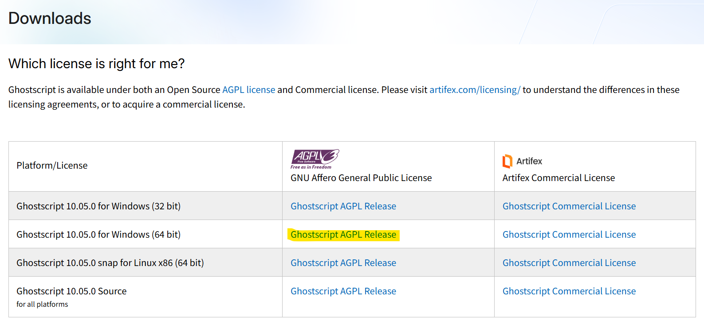

# Gradio Dashboard with OCR

## Update (as of 13 April 2025)
☑️ [Gradio branch](https://github.com/FUELNG-x-SDS/OCR/tree/gradio)
- doesn't support PostgreSQL

☑️ LNG_prototype.py
- only takes a mock PDF (from Turag)
- outputs cleaned data as excel

☑️ LNG_prototype_postgress_upload.py
- uses path from excel to upload to postgres database
- once uploaded provides a summary bar chart of the pre and post bunkering timings

☑️ LNG_prototype_query.py
- takes in ship_type(VENOSA/BELINA), year1 and year2 as inputs
- produces a bar chart for the ship at those years comparison

## About
User Interface for reading pdf files via OCR and converting the results automatically via Python into a dashboard.

<div style="text-align: center;">
    
    <p>Fig. 1: Dashboard interface for users to drag and drop their documents and have their contents extracted via OCR.</p>
</div>

<div style="text-align: center;">
    
    <p>Fig. 2: Dashboard interface for users to query and perform simple KPIs.</p>
</div>

## Installation

### Download code
```shell
git clone https://github.com/FUELNG-x-SDS/OCR.git
cd OCR
git checkout gradio
```

### Install ImageMagick for OCR pdf support
At https://imagemagick.org/script/download.php#windows

### Install GhostScript for OCR pdf support
At https://www.ghostscript.com/releases/gsdnld.html  
</img>

### Install PostgreSQL for data storing and management
At https://www.postgresql.org/download/

### Install Paddle for OCR
Note: [paddlex](https://github.com/PaddlePaddle/PaddleX) only works on python 3.8 - 3.12  
You can experience the [online demo](https://aistudio.baidu.com/community/app/91661/webUI) for free.  

Install paddle paddle via pip:
```shell
# CPU
python -m pip install paddlepaddle==3.0.0rc0 -i https://www.paddlepaddle.org.cn/packages/stable/cpu/

# GPU, this command is only suitable for machines with CUDA version 11.8
python -m pip install paddlepaddle-gpu==3.0.0rc0 -i https://www.paddlepaddle.org.cn/packages/stable/cu118/

# GPU, this command is only suitable for machines with CUDA version 12.3
python -m pip install paddlepaddle-gpu==3.0.0rc0 -i https://www.paddlepaddle.org.cn/packages/stable/cu123/
```

After installation, you can verify via
```shell
python -c "import paddle; print(paddle.__version__)"
```
With the following output of `3.0.0-rc0`  

Install paddlex with the command below:
```shell
pip install paddlex==3.0rc0
```

### Python Environment Set Up for the User Interface
```shell
pip install requirement.txt
python gradio_app.py
```
