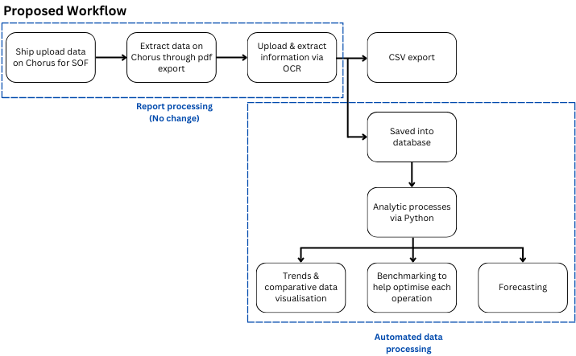

# ABS-simulation

## To-do's

- [ ] Clean up requirements.txt.
- [ ] Create gradio UI for individual report tab.
- [ ] Create gradio UI for yearly report tab.
- [ ] Create gradio UI for weekly report tab (not required).
- [ ] Deploy to cloud (if needed).

Proposed UI simulation workflow:

<div style="text-align: center;">
    
</div>

## Installation

### Download code

```shell
git clone https://github.com/FUELNG-x-SDS/OCR.git
cd OCR
```

### Python Environment Setup

> Note: [paddlex](https://github.com/PaddlePaddle/PaddleX) only works on python 3.8 - 3.12

```shell
pip install requirement.txt
python gradio_app.py
```

## About

User Interface for reading csv & pdf files and converting them into a dashboard.

## Possible Incompatibility Issues

> ERROR: pip's dependency resolver does not currently take into account all the packages that are installed. This behaviour is the source of the following dependency conflicts.
> paddlenlp 3.0.0b4 requires tokenizers<0.22,>=0.21; python_version > "3.8", but you have tokenizers 0.19.1 which is incompatible.
> gradio 5.22.0 requires aiofiles<24.0,>=22.0, but you have aiofiles 24.1.0 which is incompatible.
