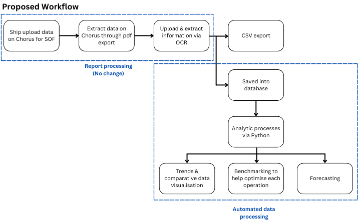

# Gradio Dashboard

## To-do's
- [X] Create gradio UI
- [ ] CSV extraction: Have functions to gain data from csv or pdf or png --> 2 types of csv format they work on.
- [ ] CSV extraction: Connect to a database or a centralised csv (if preferred).
- [ ] Individual report: Layout & summary functionality.
- [ ] Data generation: Create fake data **THAT MAKES SENSE**.
- [ ] Yearly report: Layout & graphing functionality.
- [ ] **Define new functions for noon-report**
- [ ] Deploy to cloud (if needed).

Proposed UI simulation workflow: 
<div style="text-align: center;">
    
</div>

## Installation
### Download code
```shell
git clone https://github.com/FUELNG-x-SDS/OCR.git
cd OCR
```

### Python Environment Setup
> Note: [paddlex](https://github.com/PaddlePaddle/PaddleX) only works on python 3.8 - 3.12
```shell
pip install requirement.txt
python gradio_app.py
```

## About
User Interface for reading csv & pdf files and converting them into a dashboard.
